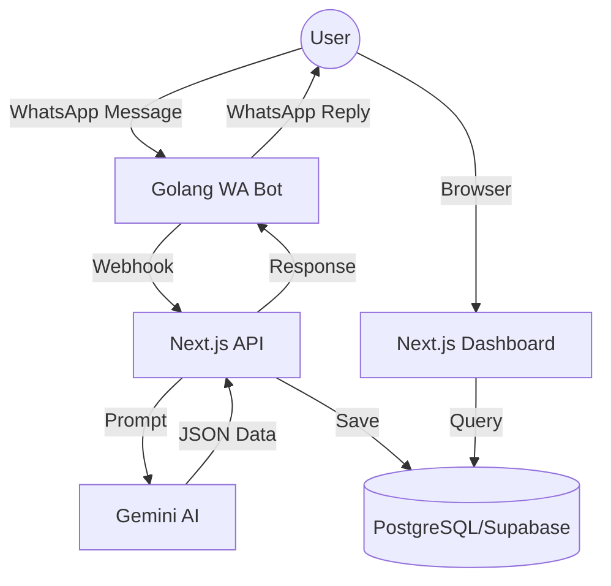

# GoTEK: Membangun Arsitektur Pelacak Keuangan Canggih Berbasis WhatsApp

Halo semua! Pernahkah Anda merasa malas mencatat pengeluaran karena harus membuka aplikasi, login, dan mengisi form yang panjang? Itulah alasan saya membangun **GoTEK**.

GoTEK adalah aplikasi manajemen keuangan pribadi yang dirancang untuk kecepatan. Alih-alih antarmuka yang rumit, GoTEK mengutamakan interaksi melalui **WhatsApp**, yang ditenagai oleh AI untuk memproses bahasa alami. 

Dalam artikel ini, saya akan membedah arsitektur teknis di balik GoTEK, mulai dari pilihan tech stack hingga bagaimana komponen-komponennya saling berkomunikasi.

---

## 🏗️ High-Level Architecture

Arsitektur GoTEK terdiri dari tiga komponen utama yang bekerja secara sinkron:

1.  **Next.js Dashboard & API**: Otak dari aplikasi, menangani UI, autentikasi, dan manajemen basis data.
2.  **Golang WhatsApp Bot**: Layer komunikasi yang menjaga koneksi persisten dengan WhatsApp Web API.
3.  **Google Gemini AI**: Mesin pemroses bahasa (NLP) yang mengubah chat berantakan menjadi data terstruktur.



---

## 🛠️ Tech Stack: Mengapa Next.js 15?

Untuk proyek ini, saya memilih **Next.js 15** dengan **React 19**. Ada beberapa alasan teknis di baliknya:

-   **Server Components & Actions**: Meminimalkan beban di sisi client dan mempercepat fetching data dari Supabase.
-   **Robust API Routes**: Sangat krusial untuk menangani webhook dari bot WhatsApp dengan latency rendah.
-   **Type Safety**: Dengan TypeScript di seluruh lapisan (dari database via Prisma hingga UI), error saat runtime dapat diminimalisir.

Di sisi database, saya menggunakan **PostgreSQL** yang di-host di **Supabase**, dengan **Prisma ORM** sebagai jembatan. Prisma memungkinkan saya untuk melakukan query yang kompleks namun tetap terbaca (clean code).

---

## 🗄️ Desain Skema Database

Salah satu tantangan terbesar adalah memetakan identitas WhatsApp ke akun pengguna. Di WhatsApp, pengguna sering menggunakan *Linked Devices*, yang menghasilkan ID berbeda namun merujuk ke orang yang sama.

Saya menggunakan model `LidMapping` untuk menangani ini:

```prisma
model LidMapping {
  id         String   @id @default(uuid())
  lid        String   @unique  // Linked ID WhatsApp
  phone      String             // Nomor Telepon Asli
  user_id    String?
  user       User?    @relation(fields: [user_id], references: [id])
}
```

Dengan skema ini, GoTEK dapat mengenali pengguna meskipun mereka mengirim pesan dari perangkat yang berbeda (HP, Tablet, atau Desktop).

---

## 🤖 Integrasi WhatsApp: Silent & Group Mode

GoTEK tidak hanya untuk penggunaan pribadi. Fitur favorit saya adalah **Kantong Grup & Patungan**. Bot dapat diundang ke grup WhatsApp komunitas atau kos-kosan.

Agar tidak mengganggu (spam), saya mengimplementasikan **Silent Mode**. Bot hanya akan merespons jika:
-   Dikirimi pesan pribadi (DM).
-   Di-tag secara eksplisit di grup (contoh: `@gotek patungan 50k`).

Logika ini dijalankan di layer Golang Bot sebelum diteruskan ke API Next.js, guna menghemat kuota API AI.

---

## 🚀 Kesimpulan Sementara

Membangun GoTEK bukan sekadar tentang membuat bot, tapi tentang menciptakan ekosistem di mana teknologi AI dan platform chat yang kita gunakan sehari-hari dapat membantu produktivitas finansial.

Di artikel berikutnya, saya akan membahas secara mendalam tentang **AI Parser** milik GoTEK: Bagaimana saya melatih prompt Gemini untuk memahami kalimat seperti *"tadi siang makan bakso 25rb pake gopay"* dan mengubahnya menjadi transaksi yang presisi.

Sampai jumpa di artikel selanjutnya!

---
*Tertarik melihat kodenya? Kunjungi repositori saya di GitHub.*
